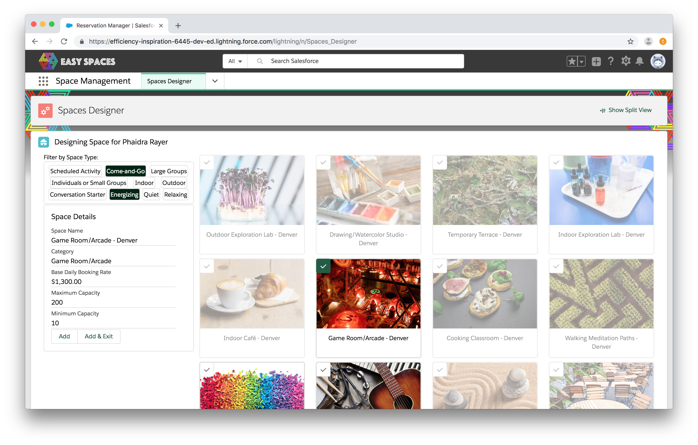
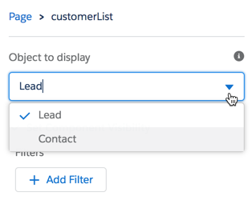

# Easy Spaces Aura Sample Application

> IMPORTANT: This is the Aura version off the Easy Spaces sample application. If you are looking for the new Lightning Web Components version, click [here](https://github.com/trailheadapps/easy-spaces-lwc).


[](https://circleci.com/gh/trailheadapps/easy-spaces/tree/master)

Easy Spaces is a fictional event management company that creates and manages custom pop-up spaces for companies and individuals. Easy Spaces helps customers create temporary spaces like cafés, game rooms or themed rooms for special occasions in their offices and homes.

[](https://youtu.be/ZwvegTLx9kk)

## Table of Contents


*   Installation
    *   [Installing Easy Spaces using Salesforce DX](#installing-easy-spaces-using-salesforce-dx)
    *   [Installing Easy Spaces by URL](#installing-easy-spaces-by-url)
*   [Features](#features)
*   [Code Highlights](#code-highlights)

## Installation


### Installing Easy Spaces using Salesforce DX

This is the recommended installation option for developers who want to experience the app and code.

1.  Authenticate with your hub org (if not already done):

    ```zsh
    sfdx force:auth:web:login -d -a myhuborg
    ```

1.  Clone this repository:

    ```zsh
    git clone https://github.com/trailheadapps/easy-spaces
    cd easy-spaces
    ```

1.  Create a scratch org and provide it with an alias (**easyspaces** in the command below):

    ```zsh
    sfdx force:org:create -s -f config/project-scratch-def.json -a easyspaces
    ```

1.  Push source to your scratch org:

    ```zsh
    sfdx force:source:push
    ```

1.  Assign two EasySpaces permission sets to the default user:

    ```zsh
    sfdx force:user:permset:assign -n EasySpacesObjects
    sfdx force:user:permset:assign -n SpaceManagementApp
    ```

1.  Load sample data:

    ```zsh
    sfdx force:data:tree:import -p ./data/Plan1.json
    sfdx force:data:tree:import -p ./data/Plan2.json
    ```

1.  Open the scratch org:

    ```zsh
    sfdx force:org:open
    ```

1. Follow the steps in the 'Completing the Installation' section below to activate the app theme.

### Installing Easy Spaces by URL
Use this option if you don't have Salesforce DX configured and want to experience the sample app. You'll be installing a series of unlocked packages.

1. [Sign up](https://developer.salesforce.com/signup) for a Developer Edition (DE) org.

1. Enable MyDomain in your DE org. Instructions to do this are [here](https://trailhead.salesforce.com/modules/identity_login/units/identity_login_my_domain).

1. Click [this link](https://login.salesforce.com/packaging/installPackage.apexp?p0=04t1I0000036tXgQAI) to install the **es-base-objects** package and choose **Install for All Users**.

1. Click [this link](https://login.salesforce.com/packaging/installPackage.apexp?p0=04t1I0000036tXlQAI) to install the **es-base-code** package and choose **Install for All Users**.

1. Click [this link](https://login.salesforce.com/packaging/installPackage.apexp?p0=04t1I0000036tXqQAI) to install the **es-base-styles** package and choose **Install for All Users**.

1. Click [this link](https://login.salesforce.com/packaging/installPackage.apexp?p0=04t1I0000036tYUQAY) to install the **es-space-mgmt** package and choose **Install for All Users**.

1.  From the command line, enter to following commands to clone this repository. You'll want to do this to get the files with sample data on your computer:

    ```zsh
    git clone https://github.com/trailheadapps/easy-spaces
    cd easy-spaces
    ```

1. Import Lead data:
    - In **Setup**, type **Data Import** in the Quick Find box and click **Data Import Wizard**.
    - Click **Launch Wizard**.
    - Click the **Standard objects** tab, click **Leads**, and click **Add New Records**.
    - Drag **Lead_Data.csv** from the data folder of this project to the upload area.
    - Click **Next**, **Next**, and **Start Import**.

1. Import Contact data:
    - In **Setup**, type **Data Import** in the Quick Find box and click **Data Import Wizard**.
    - Click **Launch Wizard**.
    - Click the **Standard objects** tab, click **Accounts and Contacts**, and click **Add New Records**.
    - Drag **Contact_Data.csv** from the data folder of this project to the upload area.
    - Click **Next**, **Next**, and **Start Import**.

1. Import Market data:
    - In **Setup**, type **Data Import** in the Quick Find box and click **Data Import Wizard**.
    - Click **Launch Wizard**.
    - Click the **Custom objects** tab, click **Market**, and click **Add New Records**.
    - Drag **Market_Data.csv** from the data folder of this project to the upload area.
    - Click **Next**, **Next**, and **Start Import**.

1. Import Spaces data:
    - Open the **Space_Data.csv** from the data folder of this project.
    - In the **Market__c** column, add the record Id for the correct Market imported in the previous step. Use the **Market City Name** column to help match spaces to the correct Market.
    - Save the changes to your file. *Note: You __must__ choose UTF-8 encoding when you save the file.*
    - In **Setup**, type **Data Import** in the Quick Find box and click **Data Import Wizard**.
    - Click **Launch Wizard**.
    - Click the **Custom objects** tab, click **Space**, and click **Add New Records**.
    - Drag **Space_Data.csv** from the data folder of this project to the upload area.
    - Click **Next**, **Next**, and **Start Import**.
    - If you see any issues with restricted picklist values blocking import, double-check that you saved your .csv with UTF-8 encoding and try again.


1. Follow the instructions in the **Completing the Installation** section below to enable the Easy Spaces custom theme.

1. In **App Launcher**, select the **Space Management** app.

1. Note: Before trying to work with the Spaces Designer, use the **Reservation Manager** to create some draft reservations.

1. Have fun exploring!

## Completing the Installation

### Activate the Easy Spaces theme
1. In **Setup**, navigate to **Themes and Branding**
1. Activate the **Easy Spaces** theme

## Features

A quick overview of the features you can explore in Easy Spaces:

*  Modular app design and Unlocked Packages
*  Lightning Console APIs & Navigation Methods
*	Lightning Flow
	*  Dynamic flow interview components
	*  Custom flow screen components
	*  Local Action components
* 	Custom Lightning Page Templates
*	Lightning Themes and Design Token Bundles
* 	Custom Metadata Types


## Code Highlights

### Dynamic Flows and Local Action Components

The **spaceDesigner** and **reservationHelper** components render flow interviews dynamically, by using the **lightning:flow** base component. You can see the **customerDetails** and **smartGallery** components at work as screens in these dynamic flows. Both of these components use the functionality of the **lightning:availableForFlowScreens** interface to control flow navigation actions.

See this [blog post](https://developer.salesforce.com/blogs/2018/06/announcing-the-easy-spaces-app.html) for more detail about custom flow navigation and dynamic flow interviews.

Components used as Lightning Flow screens also enforce a convention in the markup of their design files, to help developers better track how attributes are being used by flow interviews. See the [customerDetails](./es-space-mgmt/main/default/aura/customerDetails/customerDetails.design) and [smartGallery](./es-space-mgmt/main/default/aura/smartGallery/smartGallery.design) component design files for examples.

### Object-Agnostic Design

The **customerList** and **customerTile** components can display information from Contact objects or Lead objects.


The customerList component uses a design attribute to allow for users working in Lightning App Builder to control which object an instance of the component should display:



This is just one example of object-agnostic design at work in Easy Spaces. See this [blog post](https://developer.salesforce.com/blogs/2018/06/announcing-the-easy-spaces-app.html) for more detail about this pattern.

### Control Navigation and Behavior in Console Apps

Easy Spaces uses the Lightning Console JavaScript API to control navigation and behaviors of tabs and subtabs in the Space Management console app. You can see the lightning:workspaceAPI component at work in the **openRecordAction** component, which enables flow interviews to navigate users to a new subtab. The **reservationHelper** and **spaceDesigner** components use the lightning:navigationItemAPI component to refresh custom Lightning Page tabs in the background as a user works. You can get more detail about using the Workspace API in your components in this [blog post](https://developer.salesforce.com/blogs/2018/06/announcing-the-easy-spaces-app.html).

### Modular Design and Unlocked Packaging

Easy Spaces illustrates how to organize application metadata into granular units or modules. This approach is reflected in the design patterns at work throughout the application, like the use of design tokens and object-agnostic components. But you'll also see this at work in the structure of the Easy Spaces repo itself.

The Easy Spaces application is made of several, interdependent unlocked packages. The dependecies between the Easy Spaces packages are listed in the [sfdx-project.json](./sfdx-project.json) file for this repo.

You can also explore the contents of each package by looking at the related package folder within this repo. The `path` attribute entries in the sfdx-project.json show which folder contains the metadata for a particular package.

For more about how the Easy Spaces metadata is organized into package modules, check out [this post](https://developer.salesforce.com/blogs/2018/06/working-with-modular-development-and-unlocked-packages-part-2.html).
